# Cloud Computing: Laboratory №5 — Cloud Databases: Amazon RDS 

## Objective
The goal of this lab is to get familiar with **Amazon RDS (Relational Database Service)** and learn to:

- Create and configure relational database instances in AWS using Amazon RDS  
- Understand the concept of **Read Replicas** and use them to improve database performance and fault tolerance  
- Connect to an Amazon RDS database from an **EC2 instance** and perform basic CRUD operations (Create, Read, Update, Delete)

---

## Step 1 — Environment Preparation (VPC, Subnets, Security Groups)

1. **Create a VPC** named `project-vpc` with two public and two private subnets across different Availability Zones (AZ).  
   - These subnets will host your databases and application.  

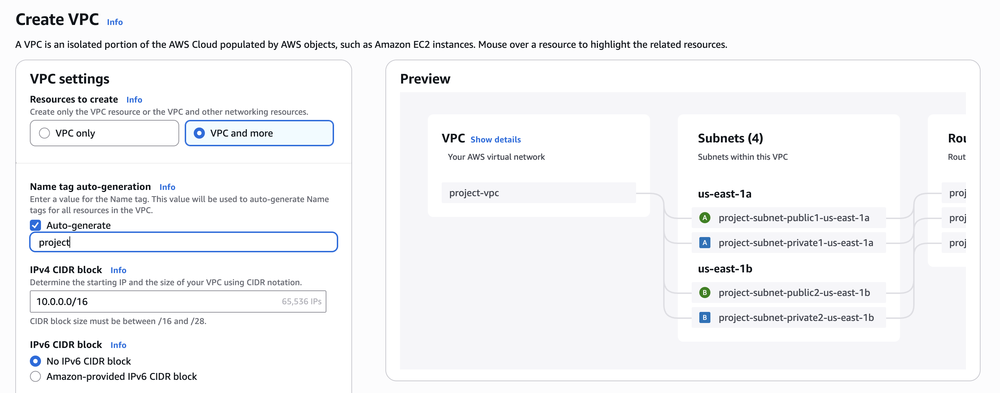

2. **Create a security group** `web-security-group` for your application with the following rules:  
   - Inbound: HTTP (port 80) from any source  
   - Inbound: SSH (port 22) from your IP address (or any source for training purposes)

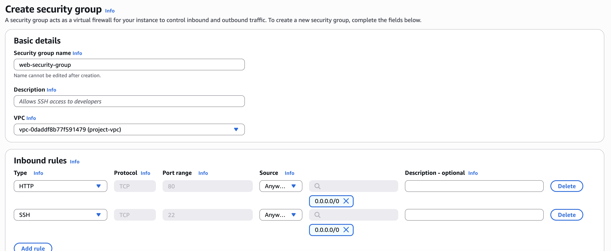

3. **Create a security group** `db-mysql-security-group` for your database with the following rule:  
   - Inbound: MySQL/Aurora (port 3306) from `web-security-group` only  
     *(i.e., only resources in this group can connect to the database)*

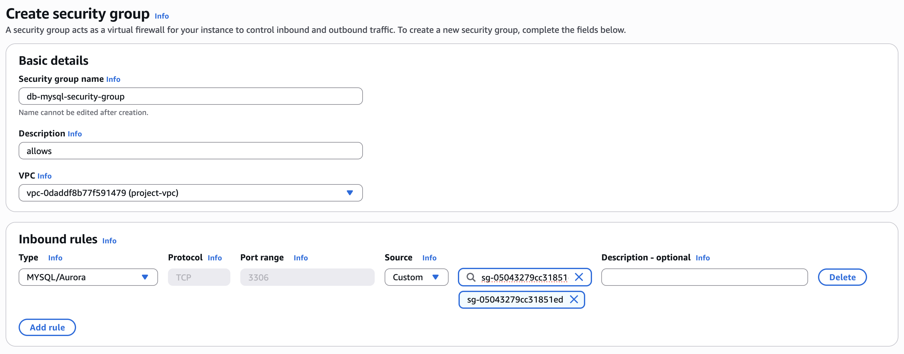

4. **Modify `web-security-group` outbound rules** to allow:  
   - Outbound: MySQL/Aurora (port 3306) to `db-mysql-security-group`  
     *(so your application can initiate a connection to the database)*

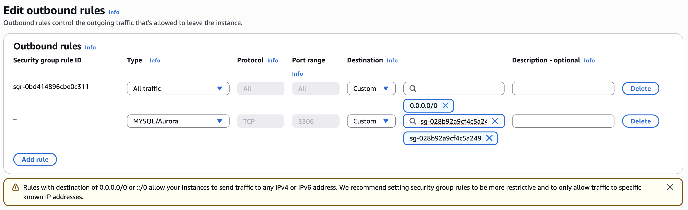

---

## Step 2 — Deploy Amazon RDS

1. Go to the **Amazon Aurora and RDS Console**.  

2. **Create a Subnet Group** for your database:  
   - Name: `project-rds-subnet-group`  
   - Select the VPC created in Step 1  
   - Add the **two private subnets** from different Availability Zones (AZ)  

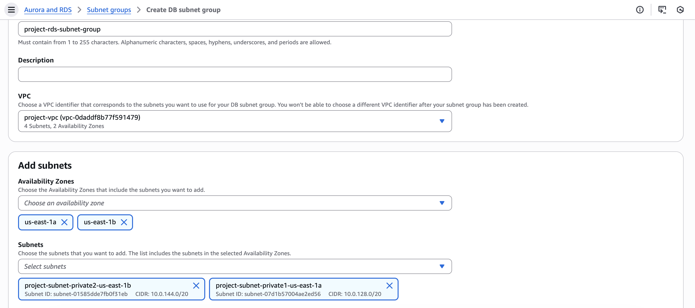

> **Note:** A Subnet Group is a collection of subnets in a VPC where your RDS instance can run. It ensures that the database is deployed in the specified subnets for availability and networking.

3. **Create a new RDS database instance**:  
   - Navigate to **Databases → Create database**  
   - Choose **Standard Create** to configure settings manually  

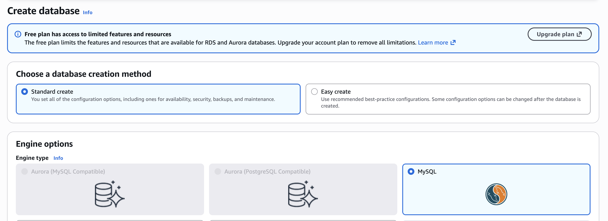

4. **Database configuration parameters**:  
   - Engine type: **MySQL**  
   - Version: **MySQL 8.0.42** (or the latest available)  
   - Template: **Free Tier**  
   - Availability and durability: **Single-AZ DB instance deployment**  
   - DB instance identifier: `project-rds-mysql-prod`  
   - Master username: `admin`  
   - Master password: set and confirm (remember it for connecting)  
   - DB instance class: **db.t3.micro**  

5. **Storage**:  
   - Storage type: **General Purpose SSD (gp3)**  
   - Allocated storage: **20 GB**  
   - Enable storage autoscaling: **Checked**  
   - Maximum storage threshold: **100 GB**  

6. **Connectivity**:  
   - Choose: **Don’t connect to an EC2 compute resource**  
   - VPC: select the VPC from Step 1  
   - DB Subnet Group: `project-rds-subnet-group`  
   - Public access: **No**  
   - Existing VPC security groups: `db-mysql-security-group`  
   - Availability zone: **No preference**  

7. **Additional configuration**:  
   - Initial database name: `project_db`  
   - Enable automated backup: **Checked** (required for Read Replica)  
   - Enable encryption: **Unchecked**  
   - Enable auto minor version upgrade: **Unchecked**  

8. Click **Create database** and wait until the status changes to **Available**.  

9. **Copy the RDS endpoint** — it will be needed for connecting from EC2.

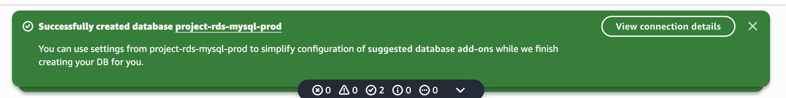

---

## Step 3 — Create an EC2 Instance to Connect to the Database

1. **Launch an EC2 instance** in a **public subnet** of your VPC.  
   - This instance will be used to connect to the RDS database.  
   - Use the **web-security-group** created in Step 1 for security.

2. **Install MySQL client** on the EC2 instance for easier database connection.  
   - You can do this during initialization with the following script:

```bash
#!/bin/bash
dnf update -y
dnf install -y mariadb105  # Install MariaDB/MySQL client (works for both MySQL and MariaDB)
```

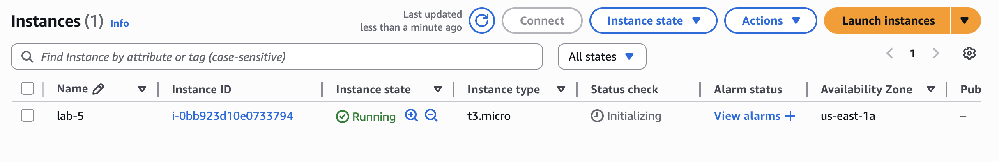

---

## Step 4 — Connect to the Database and Perform Basic Operations

1. **Connect to your EC2 instance** via SSH.

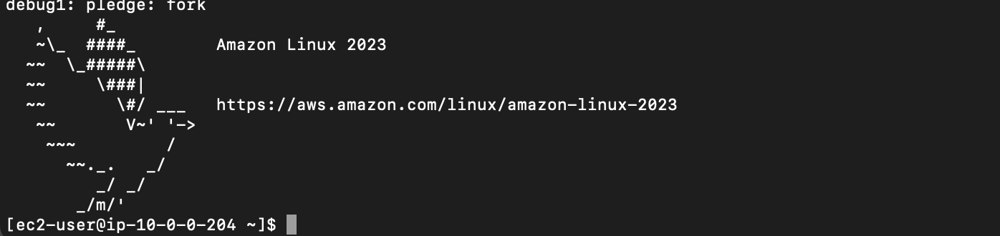

2. **Connect to the RDS database** using the MySQL client:

```bash
mysql -h <RDS_ENDPOINT> -u admin -p
```

> **Note:** Replace <RDS_ENDPOINT> with the endpoint copied from your RDS instance.
Enter the admin password you set during database creation.

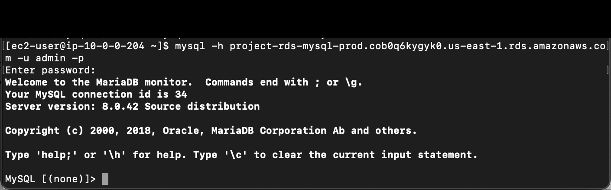

3. Select the database:

```bash
USE project_db;
```

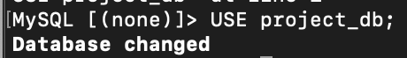

4. Create two tables with a one-to-many relationship. Example:

5. Insert sample records (at least 3 in each table):

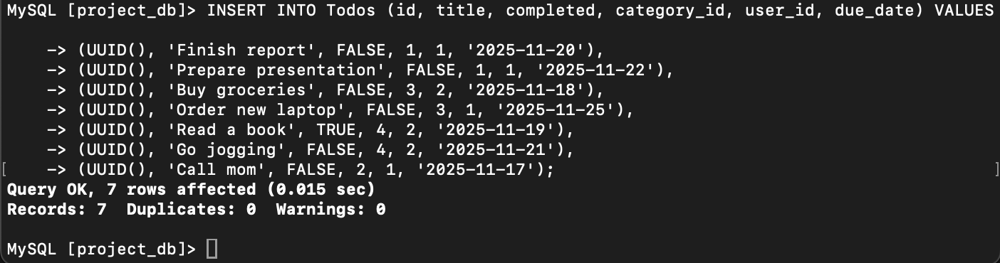

6. Perform queries, including a JOIN between tables:

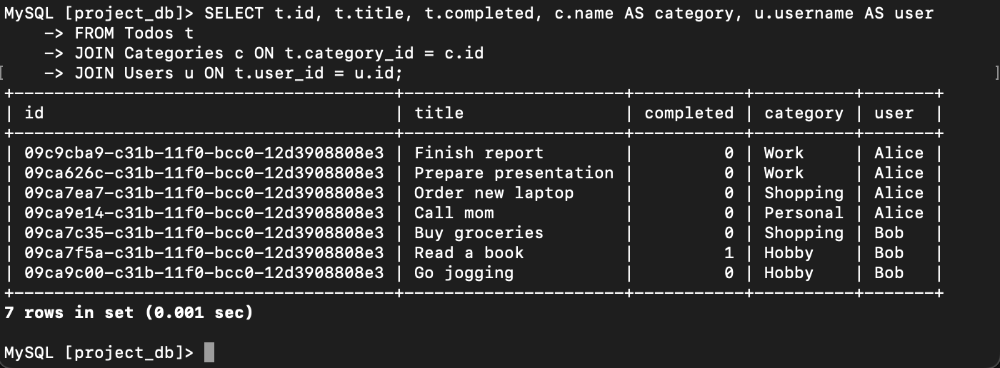

---

## Step 5 — Create and Test a Read Replica

1. **Create a Read Replica** of your RDS database:  
   - Select your main database instance in the AWS console  
   - Click **Actions → Create read replica**  
   - Set the following:
     - DB instance identifier: `project-rds-mysql-read-replica`
     - Instance class: `db.t3.micro`
     - Storage type: `General Purpose SSD (gp3)`
     - Public access: `No`
     - VPC security groups: `db-mysql-security-group`
   - Wait until the replica status changes to **Available**.  
   - Note the **endpoint** of the replica (read-only).

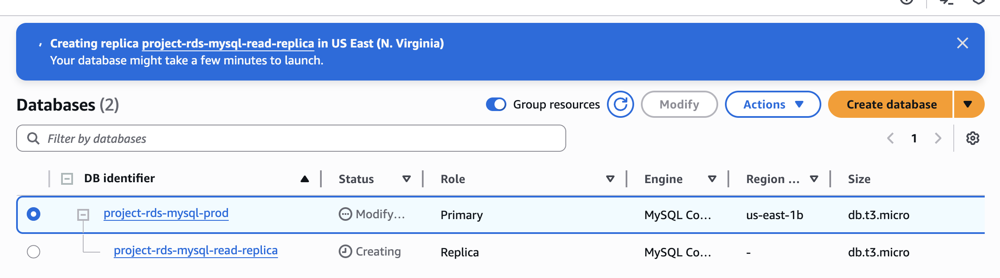

2. **Connect to the Read Replica** from your EC2 instance using the MySQL client:

```bash
mysql -h <REPLICA_ENDPOINT> -u admin -p
```

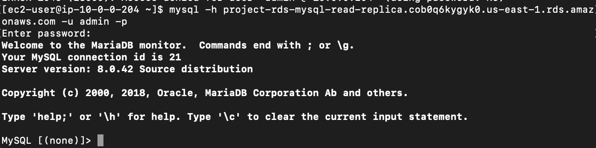

3. Perform SELECT queries on the tables created on the main instance. You should see the same data as in the primary database because the replica is synchronized.

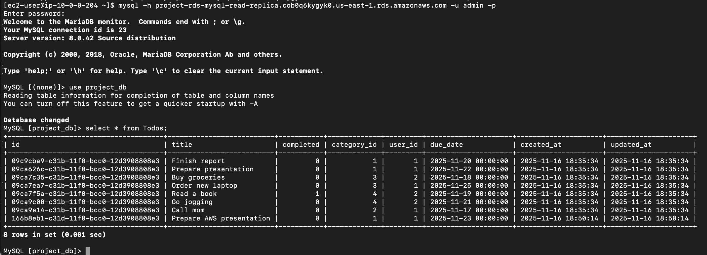

4. Test write operations (INSERT/UPDATE) on the Read Replica: These operations will fail because Read Replicas are read-only.

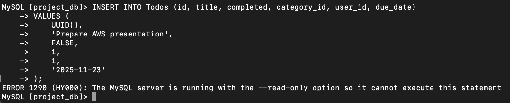

---

### Observations and Explanation

- **Data visible on the replica:** All data from the primary instance is replicated, so `SELECT` queries return the same results.  
- **Write attempts on the replica:** Fail because Read Replicas are **read-only**.  
- **New records on primary:** Are automatically replicated to the Read Replica.

### Purpose of Read Replicas

- **Improve performance:** Offload read-heavy workloads from the primary database.  
- **Increase availability:** Provide read-only access in different regions or Availability Zones (AZs).  
- **Disaster recovery:** Can be promoted to a standalone primary instance if needed.

---

## Step 6 — Connect an Application to the Database

You have two options to connect your application to Amazon RDS and perform basic CRUD operations.

### Step 6a — Deploy a CRUD Application

1. **Develop and deploy a simple web application** on your EC2 instance that connects to the RDS database.  
   - The application should support **CRUD operations**: Create, Read, Update, Delete.

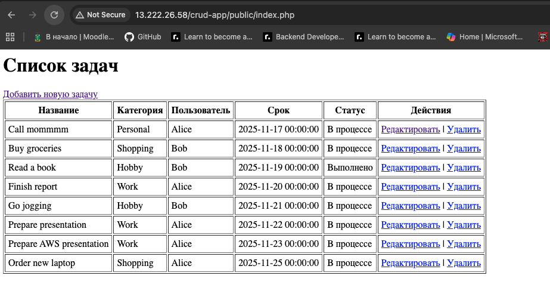

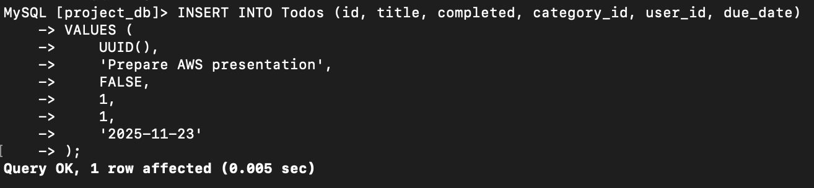

2. **Configure the application** to use:
   - **Primary RDS instance (master)** for **write operations** (INSERT, UPDATE, DELETE)  

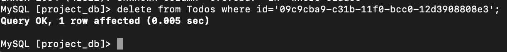

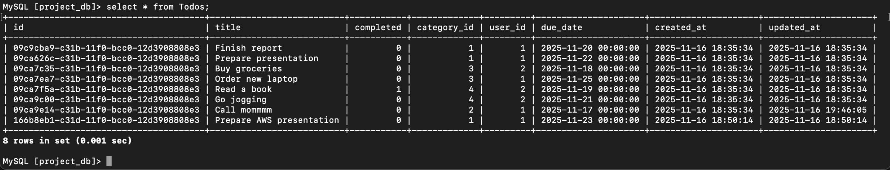

   - **Read Replica** for **read operations** (SELECT)

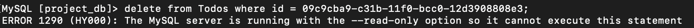


> This setup ensures that write-heavy operations do not overload the primary database, while read-heavy queries are served by the replica for better performance.

---

## Conclusion

During this lab, the main features of **Amazon RDS** and **Read Replicas** were explored and applied in practice:

- **Created and configured a VPC** with public and private subnets for database and application deployment.  
- **Deployed an Amazon RDS instance** with MySQL, configured security groups, and connected from an EC2 instance.  
- **Created tables and performed CRUD operations** using the MySQL client.  
- **Configured a Read Replica**, tested read-only queries, and verified replication from the primary database.  
- **Deployed a simple web application** with CRUD operations, using the primary instance for writes and the read replica for reads.  

As a result, practical experience was gained in using Amazon RDS for relational databases, understanding replication, and optimizing database workloads with Read Replicas.

---

## Useful Links

- [Amazon RDS — Official AWS Page](https://aws.amazon.com/rds/)  
- [Amazon RDS User Guide (AWS Documentation)](https://docs.aws.amazon.com/AmazonRDS/latest/UserGuide/Welcome.html)  
- [Cloud Databases: AWS RDS and DynamoDB](https://github.com/MSU-Courses/cloud-computing/tree/main/07_AWS_DB))


